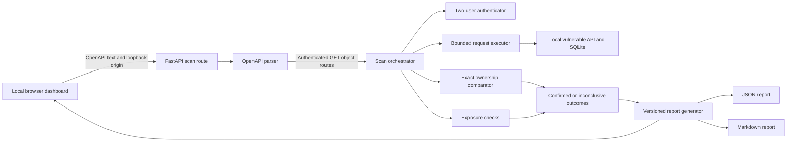
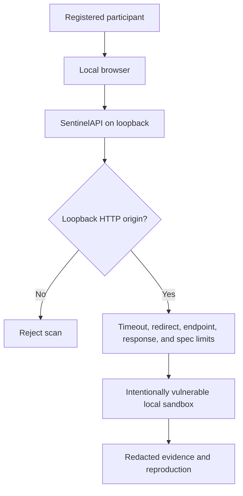
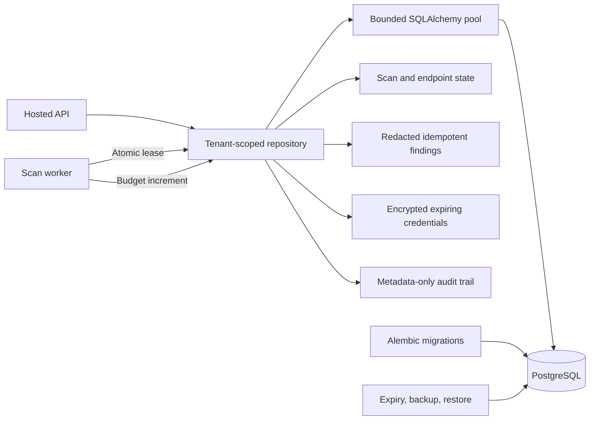

# SentinelAPI Architecture

SentinelAPI is a local-only, specification-driven scanner that compares two authorized sandbox identities. It confirms BOLA only when a cross-user response matches the object returned to its owner.

## System flow

## Trust boundaries

The browser is a presentation layer. Target validation, request limits, response comparison, and secret redaction are enforced by Python code on the server.

## Optional hosted persistence

The hosted data plane is isolated from the intentionally vulnerable demo
database. It does not weaken the loopback-only scanning boundary.

Staging and production require PostgreSQL. Development and tests may use a
separate hosted SQLite database. Organization filters are applied in repository
queries; job claims use PostgreSQL row locking with `SKIP LOCKED`; database
updates enforce deadlines and request budgets independently of browser state.
See `HOSTED_DATABASE.md` for operations and disaster recovery.

## Detection sequence

1. Parse an OpenAPI 3.x YAML or JSON document without executing YAML tags.
2. Discover up to three authenticated `GET /collection/{id}` routes with matching collection routes.
3. Authenticate User A and User B using fixed demo credentials.
4. Read each user's collection and establish the owner response for each selected object.
5. Request User B's object with User A's token.
6. Confirm BOLA only when the cross-user response is HTTP 200 and exactly matches User B's owner response.
7. Inspect User A's own object for known sensitive fields.
8. Produce pass, fail, inconclusive, or error outcomes and severity-ranked findings.
9. Redact secrets before logging, displaying, or writing any result.

## Safety controls

- Loopback HTTP targets only: `localhost`, `127.0.0.1`, and `::1`.
- Read-only scanner traffic using bounded `GET` requests.
- Origin-relative OpenAPI paths and a final scheme, host, and port check before dispatch. Environment proxies are ignored.
- Five-second request timeout, redirect blocking, three-endpoint limit, 250,000-byte specification limit, and 1,000,000-byte response limit.
- Deterministic seeded identities and orders; no real accounts or production data.
- Redacted authorization headers, tokens, and passwords.
- Ambiguous, malformed, or failed comparisons cannot become confirmed findings.

## Demonstrated scope

The MVP demonstrates one Critical BOLA finding and one High excessive-data-exposure finding against the vulnerable local order API. `app.secure_main` provides a second local target that enforces ownership and allowlists response fields so the team can demonstrate a real clean negative control. The project does not claim production scanning, complete OpenAPI support, arbitrary authentication, write-operation testing, rate-limit stress testing, or full OWASP API coverage.
