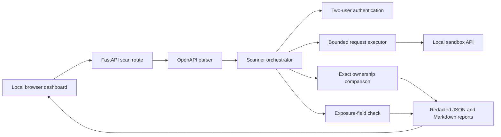

# SentinelAPI: Solution Overview

## 1. Problem being solved

APIs often confirm that a caller is logged in but fail to confirm that the caller owns the specific record being requested. For example, a customer may change an order ID in a valid request and receive another customer's order. This is Broken Object Level Authorization (BOLA), also called IDOR.

SentinelAPI is a safe, local-only scanner that demonstrates this issue with evidence. It uses two controlled users, discovers an object owned by each user, and checks whether User A can read User B's object. It also checks whether an ordinary owner response exposes fields that should remain internal.

The project is deliberately narrow. It is a hackathon MVP for proving one high-value authorization problem reliably, not a general-purpose penetration-testing platform.

## 2. Solution summary

SentinelAPI combines a deliberately vulnerable local API, a secure comparison API, and a specification-driven scanner.

1. A user opens the local browser dashboard and selects a loopback API origin plus an OpenAPI 3.x YAML or JSON document.
2. The FastAPI backend validates the request and passes it to the scanner.
3. The scanner discovers supported authenticated collection/detail `GET` endpoints from the specification.
4. It signs in as two seeded sandbox users and reads each user's collection to select one object ID per user.
5. It establishes the owner baselines, then requests User B's object with User A's token.
6. It reports BOLA only when the cross-user response is HTTP 200 and exactly equals User B's own object response.
7. It inspects User A's own response for sensitive field names such as `internal_notes` and `payment_reference`.
8. It produces a redacted JSON and Markdown report, then renders the results in the dashboard.



## 3. Technology stack

| Area | Technology | Purpose |
| --- | --- | --- |
| Backend API | Python, FastAPI, Pydantic | Local scanner API, demo endpoints, validation, and Swagger UI |
| HTTP client | HTTPX | Timeout-bound local requests with redirects and environment proxies disabled |
| API-definition parsing | PyYAML, Python JSON | Safe OpenAPI 3.x YAML/JSON ingestion and endpoint discovery |
| Local demo storage | SQLite | Deterministic users and orders for repeatable demonstrations |
| Scanner design | Typed Python dataclasses and interfaces | Replaceable authentication, transport, comparison, and reporting policies |
| Dashboard | Vanilla HTML, CSS, JavaScript | Local, dependency-free visual interface with accessible state feedback |
| Reports | JSON and Markdown | Downloadable, versioned, reproducible scan evidence |
| Testing | Python `unittest`, FastAPI TestClient, HTTPX mock transport | Vulnerable flow, secure controls, safety limits, redaction, database reset, and reports |
| Optional hosted foundation | SQLAlchemy, Alembic, PostgreSQL, Argon2, Fernet | Tenant-scoped persistence, migrations, session hashing, encrypted short-lived scan credentials, and job lifecycle support |

No remote fonts, analytics trackers, or third-party browser assets are used by the dashboard.

## 4. Main functionality

### 4.1 OpenAPI ingestion and endpoint discovery

The scanner accepts OpenAPI 3.x YAML or JSON documents up to 250 KB. It supports a deliberately small API shape:

- a collection route such as `GET /orders`;
- an authenticated object-detail route such as `GET /orders/{order_id}`;
- a declared matching path parameter; and
- a non-empty OpenAPI `security` declaration on the detail route or document.

The parser discovers at most three supported detail endpoints in one scan. It rejects destination-bearing, query-bearing, fragment-bearing, backslash, and control-character paths. OpenAPI `servers` entries are not used to choose a network destination.

### 4.2 Two-user authenticated ownership test

The MVP uses two deterministic sandbox identities:

| User | Owned order |
| --- | --- |
| User A | `1001` |
| User B | `1002` |

The scanner logs in both users through the controlled `POST /auth/login` flow. It reads each user's collection, selects the first object with a scalar `id`, and loads each object as an owner baseline.

It then issues one cross-user request: User A's bearer token requesting User B's object ID.

### 4.3 Evidence-based BOLA detection

SentinelAPI avoids reporting a vulnerability from a status code alone. A BOLA result is confirmed only when all of these are true:

1. User A and User B receive different object IDs from their collections.
2. Both owner detail requests return HTTP 200 JSON objects that match their selected IDs.
3. User A's request for User B's ID returns HTTP 200.
4. The cross-user JSON object has User B's ID and exactly equals User B's owner baseline response.

HTTP 403 and HTTP 404 are treated as successful authorization enforcement. A malformed response, a mismatched HTTP 200 response, identical IDs, failed baselines, or another unexpected result is marked `inconclusive` or `error`, never a confirmed BOLA finding.

### 4.4 Excessive data-exposure detection

The scanner evaluates User A's own object response for known sensitive field names. It supports common casing styles, so `internal_notes`, `internalNotes`, and `internal-notes` are evaluated consistently.

For the vulnerable demo, the scanner identifies `internal_notes` and `payment_reference`. The finding explains the endpoint, expected behavior, observed behavior, remediation, and a safe reproduction request.

### 4.5 Vulnerable and secure demonstration targets

The repository contains two local FastAPI targets:

- **Vulnerable target (`app.main`)**: `GET /orders/{order_id}` intentionally checks authentication but not ownership, then returns internal fields. It exists only to create one Critical BOLA and one High excessive-data-exposure finding.
- **Secure control (`app.secure_main`)**: queries an order by both ID and current owner, returns HTTP 403 for cross-user access, and allowlists response fields. It demonstrates that the scanner can produce a clean result rather than falsely report every endpoint.

The vulnerable target must remain local-only. It is a controlled fixture, not deployable application code.

### 4.6 Local dashboard

The dashboard lets a user enter a local base URL and optionally select an OpenAPI document. It displays:

- ready, running, complete, clean, inconclusive, and failed states;
- number of confirmed findings and tested endpoints;
- User A and User B baseline IDs;
- cross-user HTTP response and outcome;
- severity, evidence, expected behavior, observed behavior, remediation, and a copyable safe reproduction request; and
- JSON and Markdown download actions for the latest generated reports.

All dynamic result content is rendered using DOM nodes and `textContent`, rather than HTML injection.

### 4.7 Redacted reporting and logging

The report generator creates a schema-versioned JSON report and a readable Markdown report. Both include severity-ranked findings and endpoint outcomes: `pass`, `fail`, `inconclusive`, and `error`.

Passwords, issued bearer tokens, authorization headers, and credential-shaped fields are redacted before logs, reports, browser output, or reproduction commands are produced. Reproduction commands use `Bearer <TEST_USER_TOKEN>` rather than a real token.

### 4.8 Deterministic database reset

The local SQLite database contains fixed users and orders. `python -m app.seed` restores the same data in a transaction without deleting the SQLite file. This makes live demonstrations reproducible and supports reset on Windows even when an existing application process has the file open.

### 4.9 Optional hosted persistence foundation

The repository also includes a separate hosted persistence foundation; it is not wired into the active local scanner route. It provides a future-ready data layer without expanding scanner target access:

- organization-scoped users, scans, findings, endpoint outcomes, and audit events;
- Argon2 password hashes and revocable, hashed opaque session tokens;
- Fernet-encrypted scan credentials with short expiry and deletion on terminal scan states;
- bounded request budgets, deadlines, retention periods, worker leases, and finite scan states;
- idempotent finding storage using a scan-local fingerprint;
- Alembic migrations and PostgreSQL-only staging/production configuration; and
- explicit backup, restore, expiry, and health-check commands.

Persisted hosted scan targets now use the same loopback-only HTTP validation as the active scanner. The hosted layer therefore cannot become an external-target bypass when a worker integration is added later.

## 5. Safety and reliability controls

| Control | Implementation purpose |
| --- | --- |
| Loopback-only target policy | Accepts only `http://localhost`, `http://127.0.0.1`, and `http://[::1]` origins |
| Localhost normalization | Resolves accepted `localhost` targets to numeric `127.0.0.1` before connection |
| Request-method restriction | Uses `GET` for scanning; permits only controlled `POST /auth/login` for demo authentication |
| Final origin verification | Confirms request scheme, host, and port immediately before transport dispatch |
| Redirect and proxy controls | Blocks redirects and ignores environment proxy configuration |
| Bounded work | Five-second request timeout, three-endpoint cap, 1 MB response cap, and 250 KB specification cap |
| Safe parsing | Uses `yaml.safe_load`; unsupported or malformed documents produce controlled errors |
| Evidence threshold | Requires exact two-user response comparison for confirmed BOLA |
| Secret protection | Redacts secrets from structured logs, reports, errors, and reproduction output |
| Read-only data behavior | The scanner does not change the target API's database |

## 6. Current scope and known limitations

The MVP intentionally does not support:

- public, production, university, or company API scanning;
- HTTPS or non-loopback targets;
- OpenAPI 2.x/Swagger ingestion or complete `$ref` resolution;
- arbitrary authentication methods, token refresh, pagination, nested resources, multiple IDs, or query/header/cookie identifiers;
- write-operation testing, exploit chains, SQL injection, RCE, or high-volume rate-limit testing;
- organization-wide analytics, CI/CD enforcement, billing, multi-tenancy in the active UI, or a production deployment; and
- AI-generated findings without deterministic verification.

These exclusions are deliberate. The project prioritizes a small, honest, repeatable result over broad but unproven security claims.

## 7. Future scope

### Phase 1: strengthen the local scanner

- Support configurable local sandbox authentication profiles while preserving redaction.
- Add safe pagination handling and collection-item selection controls.
- Add limited `$ref` resolution and stronger OpenAPI semantic validation.
- Support approved nested object routes and additional identifier locations.
- Add configurable response-field allowlists to reduce exposure-check false positives.
- Improve evidence views with side-by-side, redacted owner and cross-user response diffs.

### Phase 2: complete the hosted workflow

- Build the hosted API and worker integration around the existing repository and job-lifecycle layer.
- Add organization login, role-based access control, scan history, per-scan report access, and audit-event views.
- Enforce the existing request budget and deadline from the actual worker execution path.
- Add operational metrics, backup-restore drills, retention monitoring, and alerting.
- Continue enforcing the local-only target policy unless the product scope, authorization model, and safety review are explicitly redesigned.

### Phase 3: carefully expand authorized detection coverage

- Add deterministic checks for additional API authorization failures, such as function-level authorization, only against controlled sandbox fixtures.
- Add schema-aware sensitive-data detection with explicit evidence and confidence levels.
- Add test-case templates for rate-limit configuration validation without load testing.
- Add CI integration that runs only against approved local or isolated test environments.
- Consider assisted test-case suggestions only when every generated request is bounded, reviewed, and verified by deterministic comparison logic.

## 8. How to run the demonstration

```powershell
uv venv
.\.venv\Scripts\Activate.ps1
uv pip install -r requirements.txt
python -m app.seed
uvicorn app.main:app --reload
```

Open `http://127.0.0.1:8000/`, keep the default local origin and OpenAPI document, then select **Run authorized scan**. The expected vulnerable result is one Critical BOLA finding and one High excessive-data-exposure finding.

For the secure negative control, start this in another terminal:

```powershell
uvicorn app.secure_main:app --host 127.0.0.1 --port 8011
```

Then select `openapi-secure.yaml` in the dashboard, use `http://127.0.0.1:8011`, and run the scan. The expected result is clean, with no BOLA finding.

## 9. Verification status

The CI-equivalent command resets deterministic seed data and runs API, scanner, safety, redaction, reporting, database reset, and hosted persistence tests:

```powershell
.\.venv\Scripts\python.exe -m scripts.ci
```

At the time this document was written, the full suite completed successfully with 67 passing tests.
