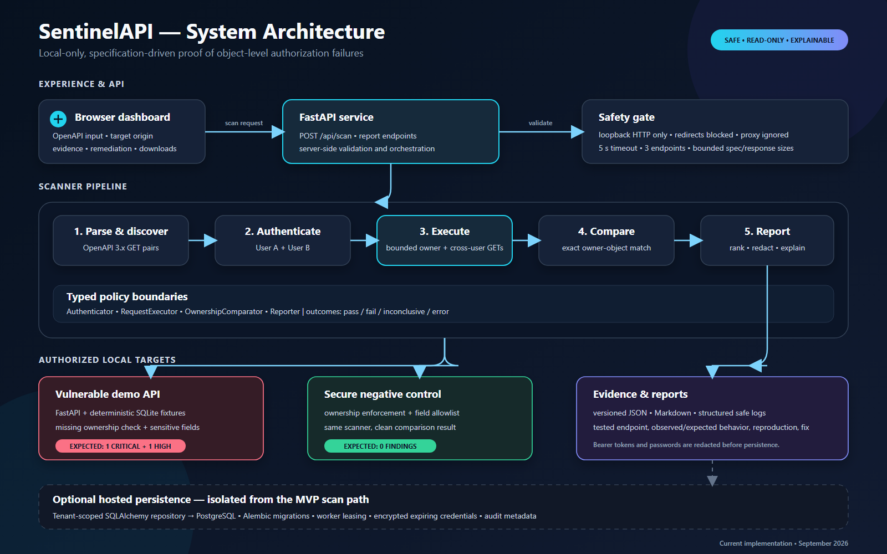

# SentinelAPI System Architecture

SentinelAPI is a safe, specification-driven API security scanner. Its MVP runs
entirely on the developer's machine and proves BOLA by comparing the same object
across two controlled user identities. The browser presents results; all target
validation, request limits, evidence comparison, and redaction are enforced on
the server.

## Runtime flow

1. The engineer supplies an OpenAPI 3.x document and a loopback HTTP origin.
2. The FastAPI scan route validates the request and invokes the scanner.
3. The parser discovers authenticated collection/detail `GET` pairs.
4. The scanner authenticates two seeded users and establishes owner baselines.
5. The bounded executor sends only controlled login and read-only requests to
   the validated loopback origin.
6. The comparator confirms BOLA only when User A receives HTTP 200 and the
   response exactly matches User B's owner response.
7. Deterministic checks inspect the owner's response for sensitive fields.
8. The reporting layer redacts secrets, ranks findings, and writes versioned
   JSON and Markdown reports for the dashboard.

## Component responsibilities

| Layer | Components | Responsibility |
| --- | --- | --- |
| Experience | Browser dashboard | Starts scans and explains live evidence, outcomes, and remediation. |
| API | `app/main.py` | Serves the UI, accepts scan requests, exposes report downloads, and hosts the intentionally vulnerable local sandbox. |
| Discovery | `scanner/openapi_parser.py` | Safely parses bounded OpenAPI YAML/JSON and discovers supported endpoint pairs. |
| Orchestration | `scanner/core.py` | Coordinates the two-user test and preserves pass, fail, inconclusive, and error outcomes. |
| Policies | Authentication, request execution, comparison, checks | Encapsulate replaceable typed policies for credentials, transport, proof, and exposure detection. |
| Reporting | Report generator, redaction, structured logging | Produces reproducible, severity-ranked evidence without exposing tokens or passwords. |
| Targets | Vulnerable API and secure control | Demonstrate a confirmed BOLA/exposure result and a clean negative control using the same scanner. |
| Local data | SQLite fixtures | Stores deterministic users and orders for repeatable demos. |

## Trust and safety boundaries

- Only `http://localhost`, `http://127.0.0.1`, and `http://[::1]` origins are
  accepted; `localhost` is pinned to `127.0.0.1`.
- Scan traffic is limited to bounded `GET` requests plus the controlled
  `POST /auth/login` call.
- Redirects are blocked, environment proxies are ignored, and the effective
  destination is checked again before each request.
- Specifications, endpoint counts, responses, and request duration are capped.
- Failed or ambiguous comparisons are reported as `inconclusive` or `error`,
  never as confirmed findings.
- Credentials and bearer tokens are redacted before display, logging, or report
  persistence.

## Deployment view

The demonstrated MVP is one local FastAPI process plus a local SQLite database.
The secure negative control runs as a second loopback FastAPI process on another
port. The repository also contains an optional, isolated hosted persistence
foundation (SQLAlchemy, PostgreSQL, Alembic, tenant-scoped repositories, and
worker leasing). It is not in the local scan request path and does not expand
the scanner's loopback-only target boundary.
